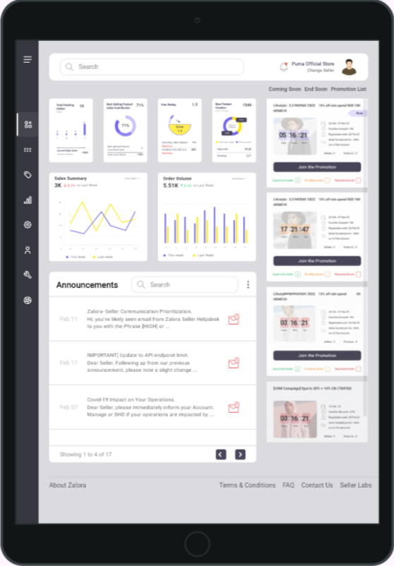
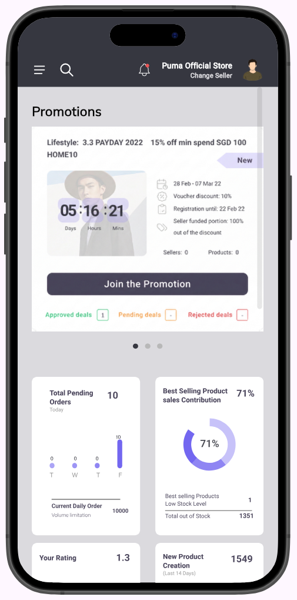

# 📊 Responsive Dashboard

A **Flutter** dashboard application built as a training project to practice **Responsive & Adaptive UI** design. This was a task for the **IEEE** team — implementing a main dashboard that adapts seamlessly across desktop, tablet, and mobile screens.

---

## ✨ Features

- 🖥️ **Desktop Layout** — Full sidebar navigation with expanded dashboard view
- 📱 **Tablet Layout** — Compact sidebar with adjusted content grid
- 📲 **Mobile Layout** — Bottom/drawer navigation with stacked content
- 📊 **Dashboard Cards** — Info cards, charts (SVG), and announcements
- 🎨 **Custom Fonts** — Roboto, Public Sans, Poppins, Mulish
- 🖼️ **SVG Assets** — Scalable vector icons and chart graphics
- 🔍 **Device Preview** — Test responsiveness using `device_preview` package

---

## 📸 Screenshots

### 🖥️ Desktop View
<p align="center">
  
</p>

### 📱 Tablet View
<p align="center">
  
</p>

### 📲 Mobile View
<p align="center">
  
</p>

---

## 🛠️ Tech Stack

| Technology | Usage |
|---|---|
| **Flutter** | UI Framework |
| **Dart** | Programming Language |
| **flutter_svg** | Rendering SVG assets |
| **device_preview** | Testing responsiveness on various devices |

---

## 🏗️ Project Structure

```
lib/
├── main.dart
├── home_view.dart
├── layout/
│   ├── adaptive_layout.dart
│   ├── desktop_layout.dart
│   ├── tablet_layout.dart
│   └── mobile_layout.dart
├── views/
│   ├── Dash_board_view.dart
│   ├── desktop_body_view.dart
│   ├── desktop_drawer.dart
│   ├── tablet_body_view.dart
│   ├── tablet_drawer.dart
│   └── promotion_list_view.dart
├── widgets/
│   ├── info_card.dart
│   ├── info_cards.dart
│   ├── announcements_widget.dart
│   ├── search_bar_widget.dart
│   ├── drawer_listView.dart
│   └── ...
├── models/
│   └── drawer_item_model.dart
└── utils/
    ├── app_styles.dart
    ├── const_colors.dart
    ├── get_responsive_size.dart
    └── ...
```

---

## 🚀 Getting Started

1. **Clone the repository**
   ```bash
   git clone https://github.com/<your-username>/responsive-dashboard.git
   ```
2. **Install dependencies**
   ```bash
   flutter pub get
   ```
3. **Run the app**
   ```bash
   flutter run
   ```

---

## 📚 Learning Resources

- 📺 [Flutter Responsive UI Playlist (Recommended for Mobile)](https://www.youtube.com/playlist?list=PLwWuxCLlF_ue_b0RZ_t6qjf_Nupkdq9BE)
- 📺 [Flutter Responsive Design Tutorial](https://www.youtube.com/watch?v=9bo1V9STW2c&list=LL&index=4)
- 🎓 [Mastering Flutter: Responsive & Adaptive UI Design [Arabic] (Recommended for Dashboard)](https://www.udemy.com/course/mastering-flutter-responsive-adaptive-ui-design-arabic/)

---

## 📄 Design

The UI is based on a **Figma design** included in the repository (`Figma Design.fig`).

---

<p align="center">
  Made with ❤️ for IEEE
</p>
